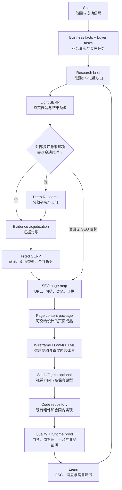

# 派生站工作流

这是一套从业务研究走到页面交付的派生站工作流，覆盖业务事实、买家任务、SEO、内容、信息架构、设计、实现和上线复核。它规定阶段顺序和交接物，不替代 `docs/质量门禁.md`、`.claude/rules/**` 或外部研究工具的方法说明。

## 总流程



核心原则：

- 一句话生成的页面只能是方向候选，不能直接进入生产分支；
- 研究工具负责发现和比较，Owner 负责确认业务事实和公开边界；
- 线框关口先验证信息架构；本项目默认用结构草图和低保真 HTML，不要求额外制作一套视觉线框稿；
- 低保真 HTML 先验证信息架构，视觉工具再处理表达；
- 原型导出的代码只能作为参考，生产实现必须回到真实代码仓库；
- 每个阶段都要记录已批准内容、仍未证明的边界和下一阶段接收方。

## 阶段与关口

| 阶段 | 要回答的问题 | 主要工具和负责人 | 交接物 | 通过条件 |
| --- | --- | --- | --- | --- |
| Scope | 这次派生做什么、不做什么？ | Owner + 策略模型 | `meta.md` 范围、目标和成功信号 | 目标、市场、语言、页面边界和停止条件已确认 |
| Business | 实际能提供什么？买家要判断什么？ | Owner、内部资料、策略模型 | 业务事实和买家任务 | 已确认、待确认、不可公开和不适用已分开 |
| Research brief | 哪些未知项会改变决策？ | 策略模型 | 研究问题树、证据缺口 | 每个研究问题对应一个下游决定 |
| Light SERP | 买家怎么说？Google 主要返回什么页面？ | live browser | 代表查询和意图假设 | 修正术语和研究问题，不在此阶段建页 |
| Deep Research | 外部资料如何解释行业、买家、标准和竞争？ | ChatGPT/Gemini Deep Research | 原始报告、来源、反证和验收笔记 | 只保留会改变决策的外部结论 |
| Evidence | 哪些结论可公开、可建页、可承诺？ | 策略模型 + Owner + 原始来源 | 证据对账、Claim/Evidence | 高风险 claim 有证据，否则降级或不发布 |
| Fixed SERP | 查询意图是否支持独立页面？ | live SERP / SerpAPI / DataForSEO | SERP 分类和页面判断 | URL owner、页面类型、合并/拆分可解释 |
| SEO map | 每个页面承接谁、回答什么、导向哪里？ | 策略模型 | SEO page map、内链、CTA、证据要求 | 没有无内容支撑页、明显 cannibalization 或孤儿页 |
| Content | 设计和开发拿到的是否是成品内容？ | 内容模型 + Owner 审核 | title、meta、H1、区块正文、CTA、链接、证据 | 不需要设计师猜业务事实或补关键文案 |
| Wireframe / Low-fi | 结构、阅读顺序和真实内容体量是否成立？ | 语义 HTML/CSS + 浏览器 | 结构草图、可浏览原型、桌面/移动截图 | 内容放得下，CTA 路径和窄屏结构成立 |
| Visual | 批准的结构如何表达成品牌视觉？ | Stitch/Figma + Owner | 视觉候选、高保真稿、状态说明 | 可复用现有系统，不依赖不可实现的效果 |
| Implement | 如何在当前仓库中实现且不破坏合同？ | Codex/工程 Agent | 生产代码和测试 | 内容源、组件、可访问性、测试和运行时边界保持有效 |
| Prove | 代码和部署是否真的成立？ | 本地门禁、CI、浏览器、Cloudflare、Owner | 质量和运行时证明 | 不把 build、Preview 或 HTTP 200 写成完整上线证明 |
| Learn | 新信号下一步改哪里？ | GSC、询盘、CRM、Owner | 继续/修改/停止决定 | 信号已回写 page map、内容或业务边界 |

## 研究方法

### Full Research 与 Delta Research

- `Full Research`：进入新市场、产品或买家，法规/履约边界变化，或现有事实不足时使用；
- `Delta Research`：同一业务换地区、换语言或做小范围派生时使用，只研究变化部分。

两种模式都从当前 `meta.md` 的决策问题开始，不因为“完整”而默认启用所有模块。

### SERP 的两次使用

第一次是 Light SERP：发现真实表达、专业词和非专业词、页面类型和研究问题。第二次是 Fixed SERP：验证搜索意图、排名页面类型、地域差异、合并/拆分和页面可进入性。Privacy、Terms、纯 Contact 或不索引的广告落地页不强制做 SERP。

### Deep Research 的研究轨道

不要提交“研究整个行业”的大 Prompt。按决策缺口选择：

```text
buyer-and-procurement
product-and-application
trust-and-standards
market-and-competition
```

Deep Research 负责外部多来源发现、比较和反证，不负责确认当前公司的供应能力、最终规格、最终 page map 或正式文案。报告和来源先进入研究工作区的 target，再由本地证据规则和 Owner 收口。

## 内容与设计交接

### 页面内容包

`Content Brief` 是内容计划；页面内容包是可以交给设计和开发的页面成品。至少包含：

```text
页面目标、页面类型、主要买家、主要搜索意图
Title、Meta description、H1、首屏结论
核心区块和顺序、已确认事实、主要 CTA
内部链接、FAQ/JSON-LD（如适用）、证据引用
内容状态、负责人、事实审核人、复核触发条件
```

高风险 claim（认证、性能、库存、交期、案例、兼容性、市场地位）才需要完整 Claim/Evidence 记录；普通说明不逐句建账。

### 线框与低保真 HTML

线框是一个决策关口，不等于必须交付一套 Figma 图片。页面级默认使用语义 HTML 和少量 CSS；站点级可以先用 Sitemap、Mermaid 或简单结构草图表达页面关系。低保真 HTML 只验证信息架构，不复制生产组件和业务逻辑。至少检查：

- 内容顺序、页面长度、真实规格和长标题；
- 首页、列表、详情和询盘之间的路径；
- 桌面、320/375px 窄屏、键盘和无 JavaScript 基本阅读。

按派生规模缩放：

| 派生变化 | 原型要求 |
| --- | --- |
| 新产品、新市场、新买家或新增页面类型 | 每种页面类型至少一个低保真 HTML |
| 复用现有结构，只替换产品和内容 | 做结构差异版低保真 HTML |
| 只改文案、图片、颜色或少量区块 | 不重做完整线框，记录变更点检查 |
| 只修技术问题且不改变页面结构 | 通常不需要线框 |

通过条件是：买家任务、内容体量、页面关系、CTA 路径和桌面/窄屏结构都成立；未通过时不得直接进入视觉原型。小型派生可以跳过完整重做，但不能跳过受影响结构的检查。

### Stitch/Figma

Stitch/Figma 只在内容包和低保真结构批准后启用，用于视觉方向、高保真原型和设计参考。输入应包含批准后的内容、区块顺序、目标买家、CTA、设计系统和禁止项。导出的 HTML/CSS 或前端代码不得直接覆盖生产仓库；它们不知道当前仓库的内容源、组件边界、测试和 OpenNext 合同。

## 交接与停止

每次阶段转换都在 `meta.md` 和 `report.md` 记录：

```text
当前阶段
阶段通过条件
接收方
已批准产物
仍未证明的边界
下一步或停止条件
```

当新增资料不再改变页面、业务或停止决定时停止研究。上线后只在新信号足以改变 page map、内容、询盘或业务边界时回写，不为了维持“持续优化”而制造新页面或新工具。
